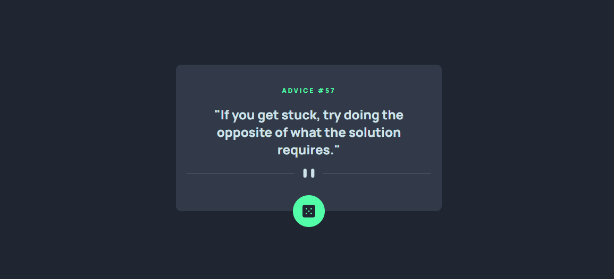
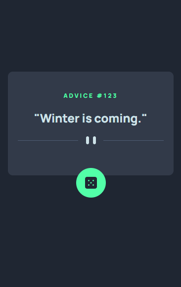

# Frontend Mentor - Advice generator app solution

This is a solution to the [Advice generator app challenge on Frontend Mentor](https://www.frontendmentor.io/challenges/advice-generator-app-QdUG-13db). Frontend Mentor challenges help you improve your coding skills by building realistic projects.

## Table of contents

- [Overview](#overview)
  - [Screenshot](#screenshot)
  - [Links](#links)
- [My process](#my-process)
  - [Built with](#built-with)
  - [What I learned](#what-i-learned)
  - [Continued development](#continued-development)
- [Author](#author)

## Overview

### Screenshot

Desktop view:


Mobile view:<br>


### Links

- Solution URL - [Frontend Mentor](https://www.frontendmentor.io/solutions/advice-generator-app-18rEbn7wSy)
- Live Site URL - [GitHub Pages](https://jjunior-dev.github.io/advice-generator-app-main/)

## My process

### Built with

- Semantic HTML5 markup
- CSS custom properties
- Flexbox
- JavaScript

### What I learned

I had my first project in JavaScript, it is a little complicate but with time i will get it.

```html
<h1>Some HTML code I'm proud of</h1>
<div>DIV</div>
```
```css
.proud-of-this-css {
  display: flex;
}
```
```js
const proudOfThisFunc = () => {
  console.log('🎉')
}
```

### Continued development

I think i have to study much more about coding in JavaScript.

## Author

- LinkedIn - [Jailton Junior](https://www.linkedin.com/in/dev-jjunior/)
- GitHub - [JJunior-Dev](https://github.com/JJunior-Dev)
- Frontend Mentor - [@JJunior-Dev](https://www.frontendmentor.io/profile/JJunior-Dev)